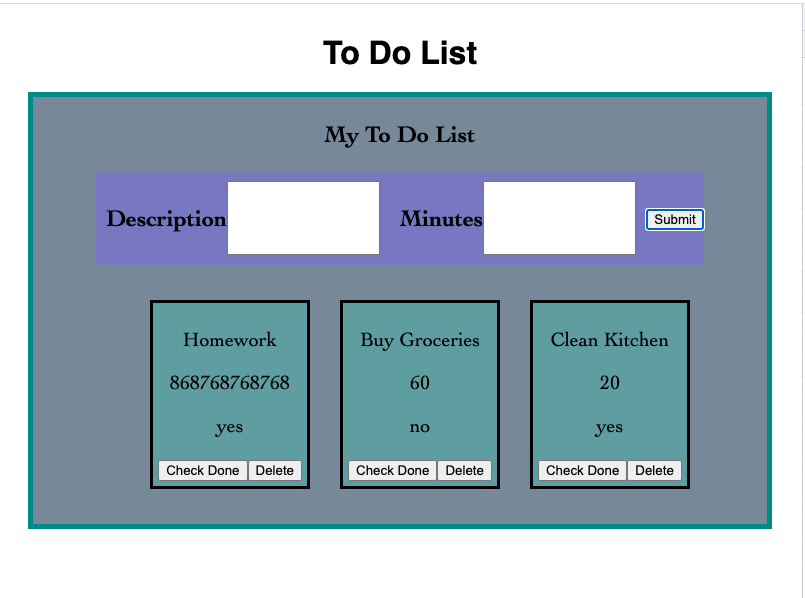

# PROJECT NAME
Weekend SQL To Do React App

## Duration: 
2 Week Sprint_

## Description
This is a SQL To-Do List application for adding to your list of things needed to do. It takes in various inputs and adds them to the database. You can complete and delete tasks as you see fit. It will update you check your task done.

## Screen Shot

### Prerequisites
- Node.js
- Axios
- React
- Postgres
- Postico

## Installation

1. Created a database named `weekend-to-do-app`,
2. The queries in the `tables.sql` file are set up to create all the necessary tables and populate the needed data to allow the application to run correctly. The project is built on [Postgres](https://www.postgresql.org/download/), so make sure to have that installed. Use Postico to run those queries.
3. Open up your editor of choice and run an `npm install`
4. Run `npm run server` in your terminal
5. Run `npm run client` in your terminal
6. The `npm run client` command will open up a new browser tab for you!

## Usage
How does someone use this application? Tell a user story here.

1. Type a description of a task 
2. Type in how many minutes it will take to complete the task
3. Click the "submit" button or press enter
4. Click the "check done" button if you completed the task 
5. Click the "check done" button TWICE if you have not completed the task
6. The to-do list will show all of your tasks and if you have completed them or not 
7. Click the "delete" button to get rid of the task completely

## Built With
- Node.js
- Axios
- React
- Postgres
- Postico

## Acknowledgement
Thanks to Prime Digital Academy who equipped and helped me to make this application a reality. Thank you Chris, Marc, and my tanzanite team!

## Support
If you have suggestions or issues, please email me at juliegonzalezkincaid@gmail.com